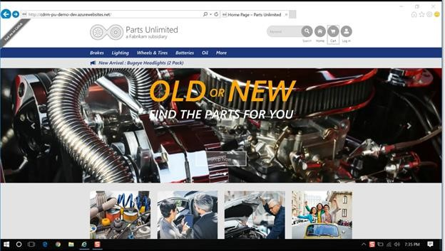

---
layout: page
title:  Create a Coded UI Test using Visual Studio
category: Testing
order: 6
---

In this lab, you will learn to create a coded UI test using Visual Studio 2017. You will create the demo test by recording actions and adding assertions using the Coded UI Test Builder. For the purposes of the lab, we will use the [PartsUnlimited web application](http://cdrm-pu-demo-dev.azurewebsites.net/) hosted on Azure to run this lab.

<h3>DevOps MPP Course Source </h3>

- This lab is used in course [DevOps200.5x: DevOps Testing](https://www.edx.org/course/devops-testing-microsoft-devops200-5x-0) - Module 5.

<h3> Pre-requisites:</h3>

- Visual Studio 2017
- Coded UI Builder needs to be installed (Requires Enterprise Edition and is an optionally installed item)
- PartsUnlimited website deployed to a Microsoft Azure Web App (see [link](https://github.com/Microsoft/PartsUnlimited/blob/aspnet45/docs/Deployment.md)).  For our purposes, we will use the PartsUnlimited website deployed at [http://cdrm-pu-demo-dev.azurewebsites.net/](http://cdrm-pu-demo-dev.azurewebsites.net/)

<h3> Lab Tasks:</h3>

- Create a Coded for a Coded UI Test by Recording and Adding Assertions 

<h3>Estimated Lab Time:</h3>

- approx. 30 minutes  

Let's get Started on the Lab

1. Launch the PartsUnlimited web application by going to the URL [http://cdrm-pu-demo-dev.azurewebsites.net/](http://cdrm-pu-demo-dev.azurewebsites.net/) 

2. This opens the PartsUnlimited application as shown below. 

    

3. Review the shopping cart and check to see it is empty.

4. Click the **Home** web link to go back to Home page. You can see that we have our Christmas discounts running on the Home page. 

    

5. Launch **Visual Studio Enterprise 2017**. 
 
6. We will now create a new project. Click **File** > **New** > **Project**. 

    

7. Project will be a Visual Studio Test project. In the **New Project** window, select **Coded UI Test Project**. Ensure project **Type** is **Visual C#**. 

8. We’ll call our project **DemoCodedUI**. Type the Name as **DemoCodedUI**. 

9. Ensure that the **Create directory for solution** check box is checked. Keep the **Add to Source Control** unchecked. Of course, in a real-world scenario you will check this. 

10. Click **OK**. 

    

    This will create the new project as **DemoCodedUI**.

    

11. Now, the **Generate Code for Coded UI Test** dialog box pops-up. It’ll ask you **How do you want to create your coded UI test?** It’ll give you a choice to record actions or to use an existing action recording. Keep the default option **Record actions, edit UI map or add assertions** selected and click **OK**.

    This brings up the **Coded UI Test Builder** at the bottom-right corner of the screen. 
 
    

12. To record what you want to do, click the **Start Recording**  button in the Coded UI Test Builder pop-up at the right bottom of the screen. 

    This starts the recording. 

    

13. Now, we will track what we will do. Click on **Lighting** menu item on the home page of the PartUnlimited web application. This moves you to the **Lighting** section. 

14. Next, we will go up and search for BugEye. Type **BugEye** in the Search field and then click Search.  This displays the Search result with the BugEye product displayed. 

    

15. Click the **BugEye** product image. This displays the BugEye product details page. 

16. Click **ADD TO CART** button. This displays the **Review your Cart** page. 
At this point we want to generate the code. 

17. Click on **Generate Code** button at the bottom-right corner of the screen in the **Coded UI Test Builder** interface. 

    

This displays the **Generate Code – Coded UI Test Builder** box. 

18. Type **AddBugeyeToCart** as the Method Name and click the **Add and Generate** button. 

    

    This generates the code.
         
    
        
19. Next thing we want is to make an assertion to make sure it made it to the cart. Click the **Add Assertion**  button on the bottom-right corner of the screen. You might also want to hit the << symbol to expand the window.

    

20. Now hover your mouse over the **Bugeeye Headlights (2 Pack)** product name shown on the screen and click Control-I to select it. This adds the Assertion to the list of controls that we care about. 

    

21. Next, add an assertion by clicking the **Add Assertion** button in the **Add Assertions: UIBugeyeHeadlights2PacHyperlink – Coded UI Test Builder** window. 

    This opens the **Add assertion for: InnerText** box. Make sure it includes **Bugeye Headlights (2 Pack)** as the **Comparison Value**. 

22. Type in the message **Cart doesn’t include bugeye** in the **Message on Assertion Failure** textbox to ensure you have a message in case it fails. 

    

23. Click **OK**. 

The assertion is now added. You can close the **Add Assertions** box. 

24. Click the **Generate Code**  button at the bottom-right corner of the screen. This displays the **Generate Code – Coded UI Test Builder** box. 

25. Type **AssertBugeyeInCart** in the **Method Name** text box.

26. Click **Add and Generate**. 

    

    This generates the code. 

27. At this point, you can resume the recording by clicking the **Resume Recording**  button at the bottom-right corner of the screen in the **UIMap – Coded UI Test Builder** tool. 

28. Click the **REMOVE** button in your shopping cart. Your cart is now empty. 
        
29. Click on **Home** link to go to the home page. 
        
30. Generate the code again by clicking the **Generate Code**   button at the bottom-right corner of the screen.
        
31. Type **CleanUp** in the **Method Name** and click the **Add and Generate** button. 

    
        
32. We are done. Close the **UIMap – Coded UI Test Builder** tool on the bottom-right corner of the screen. 
        
33. You now have your Coded UI Test. You have the **AddBugeyeToCart**, **AssertBugeyeInCart** and **CleanUp** codes. 

    
        
You are now all done with creating the Coded UI Test.  

Click the **Run Tests** menu option to run your tests. 
    

        

The test will now run on its own. 

Congratulations! You've now completed this lab. 

For more information , you can see: 
Visual Studio: [https://aka.ms/edx-devops200.5x-vs01](https://aka.ms/edx-devops200.5x-vs01) 
Web Apps: [https://aka.ms/edx-devops200.5x-az03](https://aka.ms/edx-devops200.5x-az03)
