<h1><span style="color: #0000CD;">DevOps200.5x: DevOps Testing</span></h1>
============================================================

<h2><span style="color: #0000CD;">Testing In Production Lab</span></h2>


According to the internal sales team, oil and filters are still not selling with a 20% discount. The engineering team is looking for a way to remedy this and would like to try increasing the current 5 second-interval on the homepage carousel showing the 20% discount to 20 seconds. The team would like to have 20-second intervals in a test version of the website and keep the current 5-second interval in production.

Using an additional website slot and Application Request Routing rules, the team can dynamically adjust the percentage of traffic that goes to the test slot and then ultimately draw conclusions based on the test results. If updating the carousel timer interval is beneficial, the team would like to gradually roll out the change from test into production to minimize risk (and roll back if needed).

In this lab, you will learn about adding a deployment slot to an Azure Website for deploying new features or enhancements to the website, as well as adding routing rules to direct traffic to the test site with PowerShell.  This lab will provide the foundation for which you could run an experiment using Microsoft Application Insights User telemetry metrics capabilities.

<h3><span style="color: #0000CD;"> Pre-requisites:</span></h3>

- Visual Studio 2017

- Install [Azure Power Shell](https://azure.microsoft.com/en-us/documentation/articles/powershell-install-configure/)

- PartsUnlimited website deployed to a Microsoft Azure Web App (see [link](https://github.com/Microsoft/PartsUnlimited/blob/master/docs/Deployment.md))

<h3><span style="color: #0000CD;"> Lab Tasks:</span></h3>

1. Adding a Deployment Slot to an Azure Website for Testing
2. Adding Route Rules to Direct Traffic to the Test Site with PowerShell

### Task 1: Adding a Deployment Slot to an Azure Website for Testing

PartsUnlimited already has their production website deployed and in operation. Before we can set up an A/B test and route traffic, we first need to add a new deployment slot to the production site.


**Step 1.** Open Internet Explorer and load the preview Azure Portal.

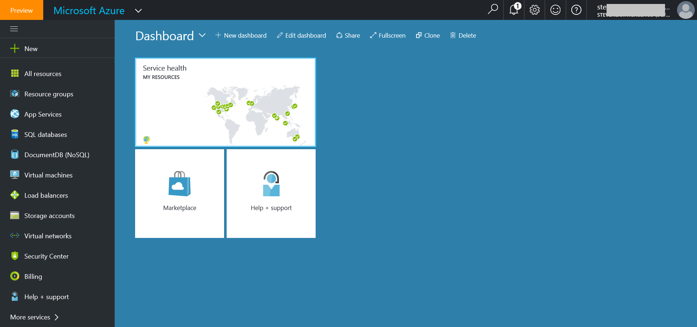

**Step 2.** Click on Resource Groups.

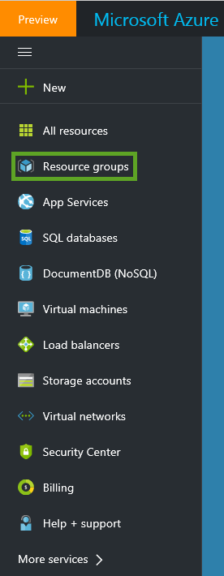

**Step 3.** Select the resource group that you deployed to prior to the demo (e.g. PartsUnlimited-dotnetcore).


**Step 4.** In the resource group blade, select the App Service resource.

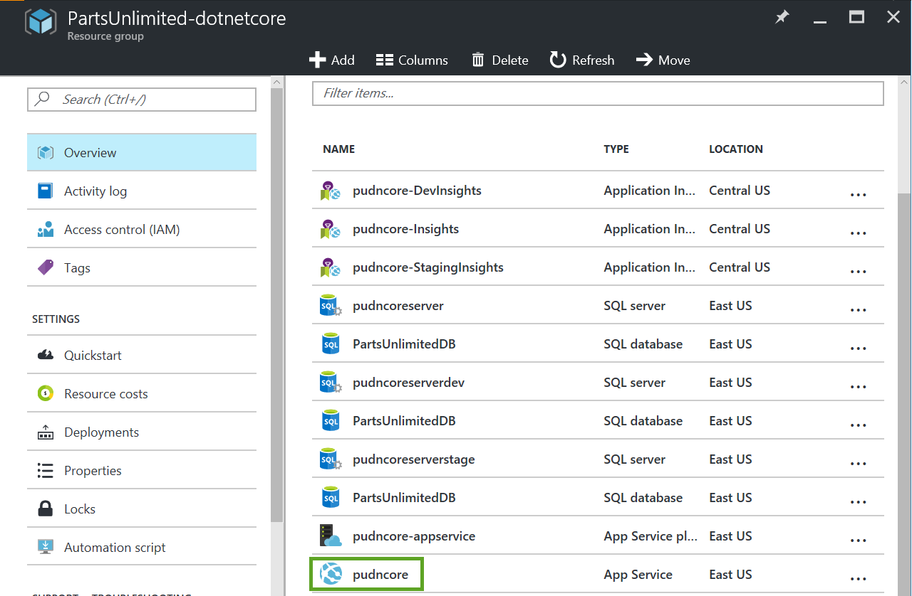

**Step 5.** In the Website resource blade, click the Browse button to view the production website.


**Step 6.** On the homepage, note the carousel image for oil and filters.


**Step 7.** Note that the image transitions within 5 seconds to the next one for new tires.

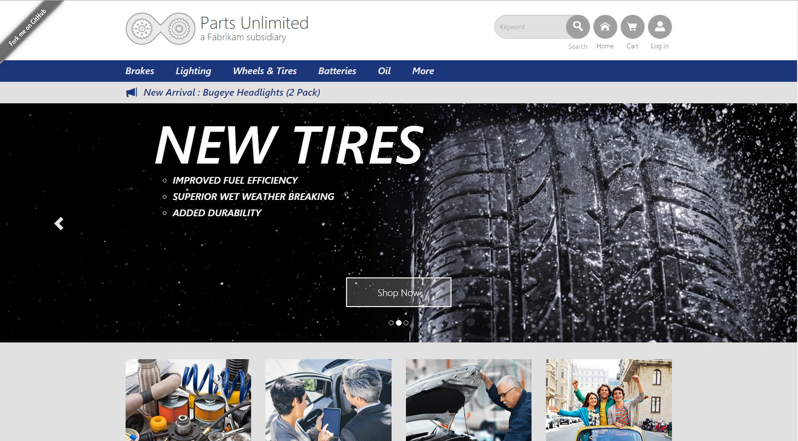

**Step 8.** Close the browser window and return to the Azure portal.

**Step 9.** In the Website resource blade, scroll down and select the Deployment Slots tile.

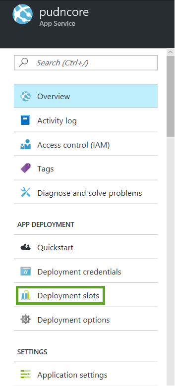

**Step 10.** In the Deployment Slots blade, click the Add Slot button.


**Step 11.** Name the new slot test. For Configuration Source, select the production website name from the drop-down. Click OK to add the new slot.

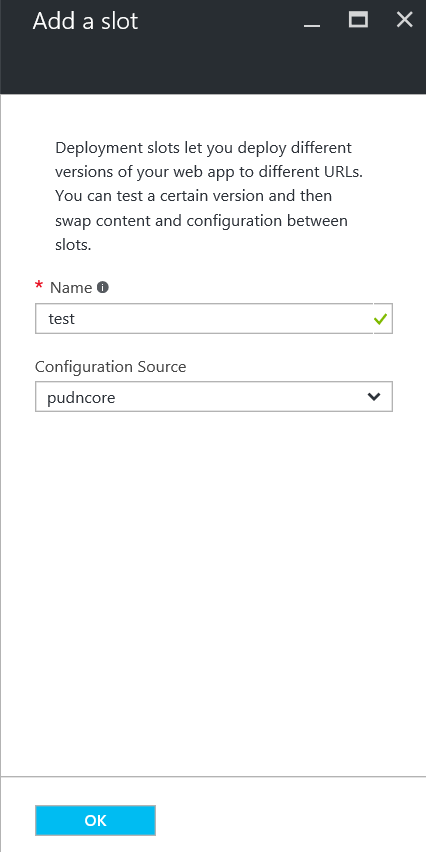

**Step 12.** In the Deployment Slots blade, click on the new slot entry.


**Step 13.** Click the Browse button.


**Step 14.** Note the domain name for the test slot (has a "-test" appended) and that it is ready for the test version of the application to be deployed.

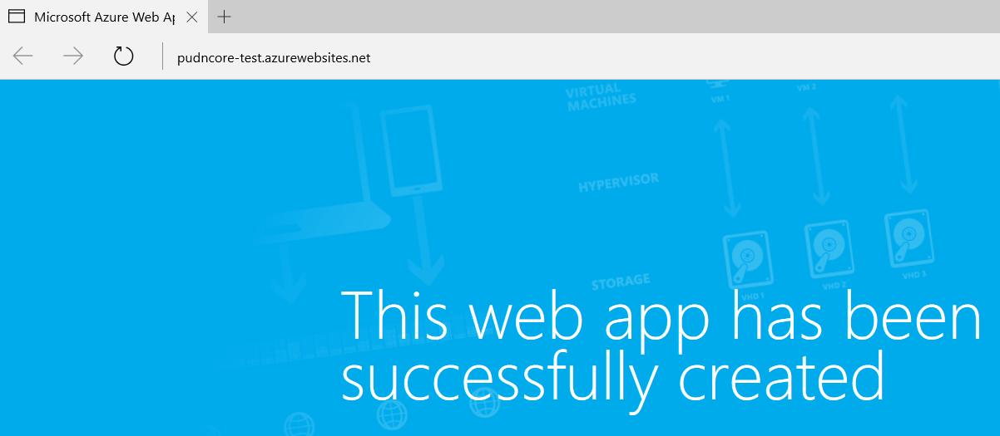

**Step 15.** Switch to Visual Studio and load the PartsUnlimited solution. In the Views -\> Home folder, open **Index.cshtml**.

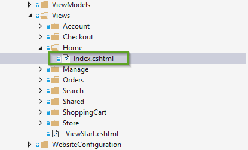

**Step 16.** In the div section for the jumbotron-carousel, add in the data-interval option and set its value to be 20000 (instead of the default of 5000). The test deployment slot will have a data-interval of 20 seconds, while production will still keep 5 seconds.
>**Note:** A carousel with 20-second interval might look like just an image to users and therefore this value is not recommended to be used in production. Here it's used for demo purposes only.


**Step 17.** Save your changes.

**Step 18.** In Solution Explorer, Right-click on the PartsUnlimited.Website project and select Publish.

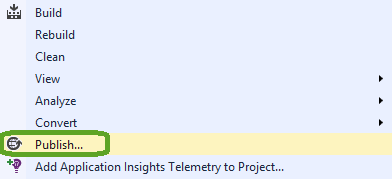

**Step 19.** Click Publish.

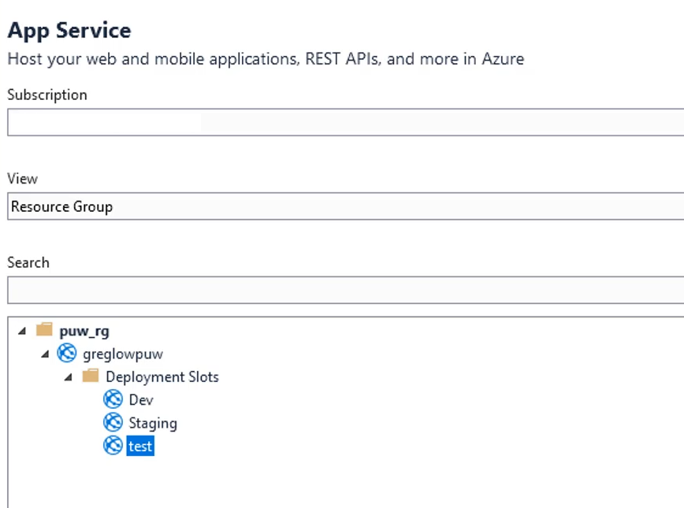

**Step 20.** After publication is complete, a browser window should open and navigate to the homepage. Verify that the test site waits for 20 seconds before transitioning between images in the carousel.


**Step 21.** Close the browser window.


### Task 2: Adding Route Rules to Direct Traffic to the Test Site with PowerShell (Not available using Azure CLI yet)

Now that we have published our new changes to the test deployment slot, we want to add routing rules so that the majority of traffic will go to the test deployment slot instead of production.
 

**Step 1.** Open Microsoft Azure PowerShell window.


**Step 2.** Type the following command and then login to authorize this PowerShell instance to access your Azure account:

		Add-AzureAccount


**Step 3.** Type the following command and then your Azure subscription name:

		Select-AzureSubscription


**Step 4.** Type the following to create a variable with your website name (replace `pudncore` with your website's name):

```powershell
	$siteName = "pudncore"
```


**Step 5.** Type in the Azure Powershell window the following lines:

```powershell
	$rulesList = New-Object -TypeName System.Collections.Generic.List[Microsoft.WindowsAzure.Commands.Utilities.Websites.Services.WebEntities.RampUpRule]
	$rule = New-Object -TypeName Microsoft.WindowsAzure.Commands.Utilities.Websites.Services.WebEntities.RampUpRule
	$rule.Name = “test”
	$rule.ActionHostName = "$siteName-test.azurewebsites.net"
	$rule.ReroutePercentage = 99
	$rulesList.Add($rule)
	Set-AzureWebsite -RoutingRules $rulesList -Name $siteName -Slot production
```


**Step 6.** Back in the preview Azure Portal, refresh the page (F5) and then navigate to the production website resource. Click on Testing in production. Note that the routing rule that is sending traffic to the test slot is now setup.
>**Note:** It is possible to set up the routing split entirely in the Azure Portal. To achieve this just selecting the slot and percentage of traffic to reroute.

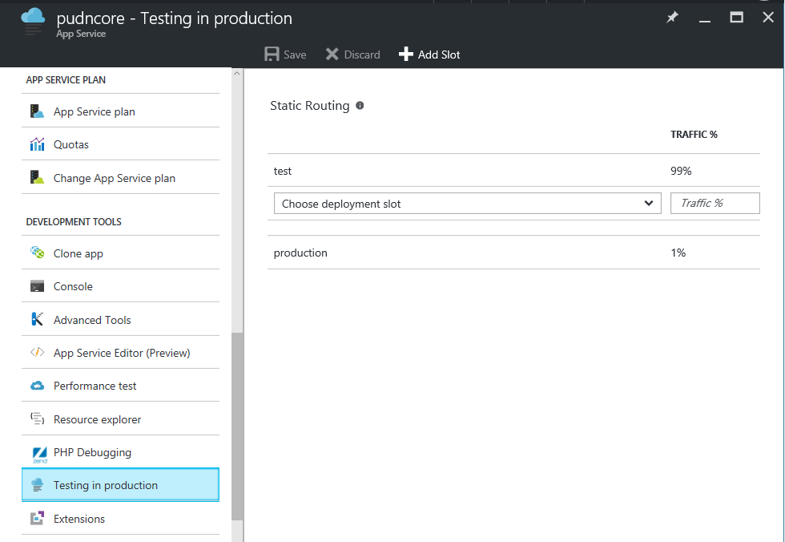

**Step 7.** Return to the demo website resource blade, click on Overview and then on the Browse button at the top to load the site in a browser window.


**Step 8.** Navigate to the Homepage and note that the interval between images on the carousel waits for 20 seconds instead of 5.


Next steps
----------

In this lab, you learned about adding a deployment slot to an Azure Website for deploying new features or enhancements to the website, as well as adding routing rules to direct traffic to the test site with PowerShell.  This lab provided the foundation for which you could run an experiment using Microsoft Application Insights User telemetry metrics capabilities.

Try these labs out for next steps:

- Application Performance Monitoring hands-on lab
- Load Tests and Auto-Scaling hands-on lab
