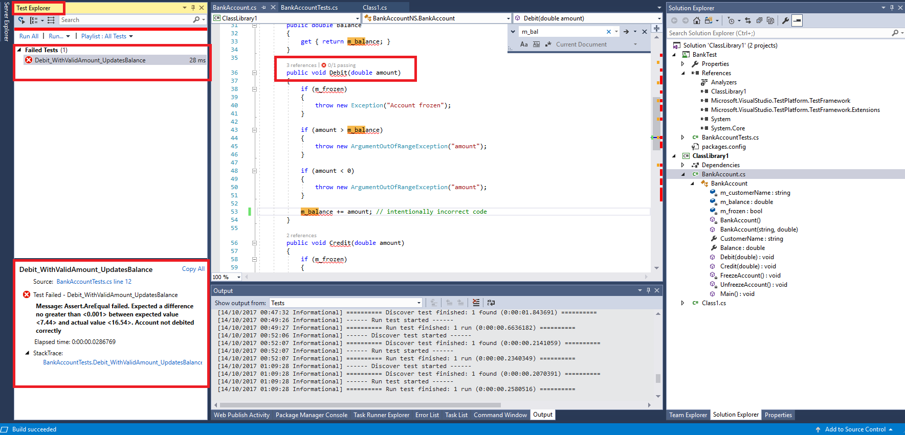
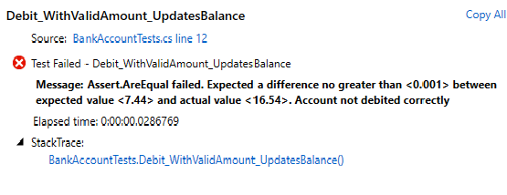
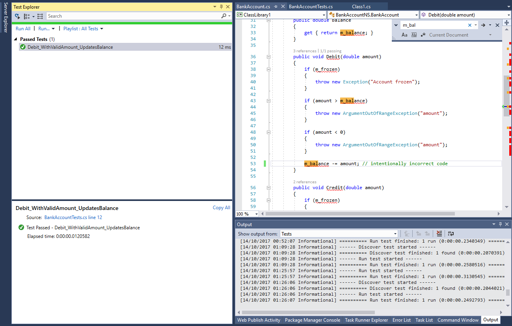

This lab walkthrough will step you through creating, running, and customizing a series of unit tests using the Microsoft unit test framework for managed code and the Visual Studio Test Explorer. You start with a C# project that is under development, create tests that exercise its code, run the tests, and examine the results. Then you can change your project code and re-run the tests.

<h3><span style="color: #0000CD;">DevOps MPP Course Source </span></h3>

- This lab is used in course [DevOps200.5x: DevOps Testing](https://www.edx.org/course/devops-testing-microsoft-devops200-5x-0) - Module 2.


<h3><span style="color: #0000CD;"> Pre-requisites:</span></h3>
You will require the following:

1. Review the [Sample Project for Creating Unit Tests](https://msdn.microsoft.com/en-us/library/ms243176.aspx) . You will use the sample code provided here in the lab walkthrough.

2. Visual Studio 2017: see https://www.visualstudio.com/ for details.


<h3><span style="color: #0000CD;"> Lab Tasks:</span></h3>

1. Prepare the walkthrough
2. Create a unit test project
3. Create the test class
4. Test class requirements
5. Create the first test method
6. Test method requirements
7. Build and run the test
8. Fix your code and rerun your tests
9. Use unit tests to improve your code


<h3><span style="color: #0000CD;">Estimated Lab Time:</span></h3>

- approx. 40 minutes  


### Task 1: Prepare the Walk through

1. Open Visual Studio 2017

2. On the **File** menu, point to **New** and then click **Project**.

3. The **New Project** dialog box appears.

4. Under **Installed**, expand **Visual C#**.

5. In the subsequent list of application types, click **Class Library (.NET Standard)**.

6. In the **Name** box, type **Bank** and then click **OK**.

**Note:** If the name **Bank** is used choose another name for the project

7. The new **Bank** project is created and displayed in **Solution Explorer** with the **Class1.cs** file open in the Code Editor.

**Note:** If the **Class1.cs** file is not open in the **Code Editor**, double-click the file **Class1.cs** in **Solution Explorer** to open it.


8. Go to the page [Sample Project for Creating Unit Tests](https://docs.microsoft.com/en-us/visualstudio/test/sample-project-for-creating-unit-tests) and copy the code in the **Sample Code** window on that page.

9. Replace the original contents of **Class1.cs** with the code from the **Sample Project for Creating Unit Tests**.

10. Go to **File > Save Class1.cs As…** and save the file as **BankAccount.cs**

11. On the **Build** menu, click **Build Solution**.

12. You now have a project named **Bank**. It contains source code to test and tools to test it with. The namespace for Bank, **BankAccountNS**, contains the public class **BankAccount**, whose methods you will test in the following procedures.

In this quick start, we focus on the **Debit** method. The Debit method is called when money is withdrawn from an account and contains the following code:

```csharp
//Debit Method code
public void Debit(double amount)
{
if (m_frozen)
{
throw new Exception("Account frozen");
}
if (amount > m_balance)
{
throw new ArgumentOutOfRangeException("amount");
}
if (amount < 0)
{
throw new ArgumentOutOfRangeException("amount");
}
m_balance += amount; // intentionally incorrect code
}
```

### Task 2: Create a Unit Test Project
1. On the **Fil**e menu, choose **Add**, and then choose **New Project ...**

2. In the **Add New Project** dialog box, expand Installed, expand Visual C#, and then choose Test.

3. From the list of templates, select **Unit Test Project(.NET framework)**

4. In the **Name** box, enter **BankTest**, and then choose **OK**.

5. The **BankTest** project is added to the **Bank** solution.

6. The **BankTest** project needs a reference to the Bank solution. In **Solution Explorer**, select **BankTest > References** and then choose **Add Reference...** from the context menu.

7. In the **Reference Manager - BankTest** dialog box, expand **Projects > Solution** and then check the **Bank** item and click **OK**


### Task 3: Create the Test Class
We need a test class for verifying the **BankAccount** class. We can use the **UnitTest1.cs** that was generated by the project template, but we should give the file and class more descriptive names. We can do that in one step by renaming the file in Solution Explorer.

<h4><span style="color: #0000CD;">Renaming a class file</span></h4>

1. In **Solution Explorer**, go to **Bank** solution, > **BankTest** > and right click on the **UnitTest1.cs** file.

2. From the context menu, choose **Rename**, and then rename the file to **BankAccountTests.cs**.

3. If prompted choose **Yes** on the dialog that asks if you want to rename all references in the project to the code element *UnitTest1*.

This step changes the name of the class to **BankAccountTests**. The **BankAccountTests.cs** file now contains the following code.

If you did not get prompted as outlined above ensure you modify the public class to be as in the below sample code.

```csharp
//Unit test code
using System;
using Microsoft.VisualStudio.TestTools.UnitTesting;
namespace BankTest
{
[TestClass]
public class BankAccountTests
{
[TestMethod]
public void TestMethod1()
{
}
}
}
```

<h4><span style="color: #0000CD;"> Add a using statement to the project under test</span></h4>

We can also add a using statement to the class to let us to call into the project under test without using fully qualified names. At the top of the class file, add:

```csharp
using BankAccountNS;
```


The **BankAccountTests.cs** class file code should now look the below

```csharp
//Unit test code
using System;
using Microsoft.VisualStudio.TestTools.UnitTesting;
using BankAccountNS;
namespace BankTest
{
[TestClass]
public class BankAccountTests
{
[TestMethod]
public void TestMethod1()
{
}
}
}
```

#### Test class requirements ####

The minimum requirements for a test class are the following:

- The [TestClass] attribute is required in the Microsoft unit testing framework for managed code for any class that contains unit test methods that you want to run in Test Explorer.

- Each test method that you want Test Explorer to run must have the [TestMethod] attribute.

You can have other classes in a unit test project that do not have the [TestClass] attribute, and you can have other methods in test classes that do not have the [TestMethod] attribute. You can use these other classes and methods in your test methods.


### Task 4: Create the Test Class
In this procedure, we will write unit test methods to verify the behaviour of the **Debit** method of the BankAccount class. The method is earlier listed above in this document.

By analyzing the method under test, we determine that there are at least three behaviours that need to be checked:

1. The method throws an ArgumentOutOfRangeException if the debit amount is greater than the balance.
2. It also throws ArgumentOutOfRangeException if the debit amount is less than zero.
3. If the checks in 1. and 2. above are satisfied, the method subtracts the amount from the account balance.

In our first test, we verify that a valid amount (one that is less than the account balance and that is greater than zero) withdraws the correct amount from the account.

<h4><span style="color: #0000CD;"> To create a test method </span></h4>
1. If it is not already present add a the following using BankAccountNS; statement to the BankAccountTests.cs file. The start of the file should now look like this

```csharp
using System;
using Microsoft.VisualStudio.TestTools.UnitTesting;
using BankAccountNS;
```

2. Add the below Method to that BankAccountTests class i.e. Overwite the [TestMethod] code that is present in the file with the below, then from the **File** menu, click **Save All**. The file code should now look as follows:

```csharp
//Unit test code
using System;
using Microsoft.VisualStudio.TestTools.UnitTesting;
using BankAccountNS;
namespace BankTest
{
[TestClass]
public class BankAccountTests
{
[TestMethod]
public void Debit_WithValidAmount_UpdatesBalance()
{
// arrange
double beginningBalance = 11.99;
double debitAmount = 4.55;
double expected = 7.44;
BankAccount account = new BankAccount("Mr. Bryan Walton", beginningBalance);
// act
account.Debit(debitAmount);
// assert
double actual = account.Balance;
Assert.AreEqual(expected, actual, 0.001, "Account not debited correctly");
}
}
}
```

The method is rather simple. We set up a new **BankAccount** object with a beginning balance and then withdraw a valid amount. We use the Microsoft unit test framework for managed code [AreEqual](https://msdn.microsoft.com/en-us/library/ms244172(v=vs.140).aspx) method to verify that the ending balance is what we expect.

**Test method requirements:** 

A test method must meet the following requirements:
- The method must be decorated with the **[TestMethod]** attribute.
- The method must return void.
- The method cannot have parameters.

### Task 5: Build and Run the Test

1. Go to **Build > Build Solution** to build the solution.

2. If there are no errors, the UnitTestExplorer window may appears with Debit_WithValidAmount_UpdatesBalance listed in the Not Run Tests group.
If Test Explorer does not appear after a successful build, then go to Test > Windows > Test Explorer

3. In Test Explorer click Run All to run the test. As the test is running the status bar at the top of the window is animated. At the end of the test run, the bar turns greengreengreen green if all the test methods pass, or red if any of the tests fail.

4. In this case, the test does fail. Select the method in Test Explorer to view the details at the bottom of the window, as per the screenshot below. Note also the presence of Red Circles with X’s in them in the BankAccount.cs class file to indicate a fail




### Task 6: Fix Your Code and Rerun Your Tests

<h4><span style="color: #0000CD;"> Analyze the test results </span></h4>
The test result output in Test Explorer contains a message that describes the failure.

For the **AreEquals** method, message displays you what was expected (**the Expected <XXX>parameter**) and what was actually received (**the Actual<YYY> parameter**).

We were expecting the balance to decline from the beginning balance, but instead it has increased by the amount of the withdrawal. i.e. as in the screenshot below



A re-examination of the Debit code shows that the unit test has succeeded in finding a bug. The amount of the withdrawal is added to the account balance when it should be subtracted.


<h4><span style="color: #0000CD;"> Correct the bug </span></h4>
To correct the error, Open the file BankAccount.cs, search for and replace the line

```csharp
m_balance += amount;
```
with

```csharp
m_balance -= amount;
```

<h4><span style="color: #0000CD;">Rerun the test</span></h4>

From the **File** menu, click **Save All*. From the **Build** menu, click **Build Solution**. When the solution builds successfully, in **Test Explorer**, choose **Run All** to rerun the test. The test is passed and the red turns green as in the screenshot below.




### Task 6: Fix Your Code and Rerun Your Tests (Optional)

This section describes how an iterative process of analysis, unit test development, and refactoring can help you make your production code more robust and effective. It will step through the thought process and methodology and is an optional exercise you can complete if you wish.

<h4><span style="color: #0000CD;">Analyze the issues</span></h4>
After creating a test method to confirm that a valid amount is correctly deducted in the Debit method, we can turn to remaining cases in our original analysis:

1. The method throws an ArgumentOutOfRangeException if the debit amount is greater than the balance.

2. It also throws ArgumentOutOfRangeException if the debit amount is less than zero.


<h4><span style="color: #0000CD;">Create the test methods</span></h4>
A first attempt at creating a test method to address these issues seems promising:

```csharp
//unit test method
[TestMethod]
[ExpectedException(typeof(ArgumentOutOfRangeException))]
public void Debit_WhenAmountIsLessThanZero_ShouldThrowArgumentOutOfRange()
{
// arrange
double beginningBalance = 11.99;
double debitAmount = -100.00;
BankAccount account = new BankAccount("Mr. Bryan Walton", beginningBalance);
// act
account.Debit(debitAmount);
// assert is handled by ExpectedException
}
```


We use the [ExpectedExceptionAttribute](https://msdn.microsoft.com/en-us/library/microsoft.visualstudio.testtools.unittesting.expectedexceptionattribute(v=vs.140).aspx) attribute to assert that the right exception has been thrown. The attribute causes the test to fail unless an **ArgumentOutOfRangeException** is thrown. Running the test with both positive and negative **debitAmount** values and then temporarily modifying the method under test to throw a generic [ApplicationException](https://docs.microsoft.com/en-ie/dotnet/api/System.ApplicationException?view=netframework-4.7) when the amount is less than zero demonstrates that test behaves correctly. To test the case when the amount withdrawn is greater than the balance, we need to

1. Create a new test method named Debit_WhenAmountIsMoreThanBalance_ShouldThrowArgumentOutOfRange.

2. Copy the method body from Debit_WhenAmountIsLessThanZero_ShouldThrowArgumentOutOfRange to the new method.

3. Set the debitAmount to a number greater than the balance.

<h4><span style="color: #0000CD;">Run the tests </span></h4>

Running the two methods with different values for **debitAmount** demonstrates that the tests adequately handle our remaining cases. Running all three tests confirm that all cases in our original analysis are correctly covered.


<h4><span style="color: #0000CD;">Continue the analysis</span></h4>

However, the last two test methods are also somewhat troubling. We cannot be certain which condition in the code under test throws when either test runs. Some way of differentiating the two conditions would be helpful. As we think about the problem more, it becomes apparent that knowing which condition was violated would increase our confidence in the tests. This information
would also very likely be helpful to the production mechanism that handles the exception when it is thrown by the method under test. Generating more information when the method throws would assist all concerned, but the **ExpectedException** attribute cannot supply this information.

Looking at the method under test again, we see both conditional statements use an **ArgumentOutOfRangeException** constructor that takes name of the argument as a parameter:

```csharp
throw new ArgumentOutOfRangeException("amount");
```

From a search of the MSDN Library, we discover that a constructor exists that reports far richer information. [ArgumentOutOfRangeException](https://docs.microsoft.com/en-ie/dotnet/api/System.ArgumentOutOfRangeException.-ctor?view=netframework-4.7) (**String, Object, String**) includes the name of the argument, the argument value, and a user-defined message. We can refactor the method under test to use this constructor. Even better, we can use publicly available type members to specify the errors.

<h4><span style="color: #0000CD;">Refactor the code under test</span></h4>

We first define two constants for the error messages at class scope:

```csharp
// class under test
public const string DebitAmountExceedsBalanceMessage = "Debit amount exceeds balance";
public const string DebitAmountLessThanZeroMessage = "Debit amount less than zero";
```


We then modify the two conditional statements in the Debit method:

```csharp
// method under test
// ...
if (amount > m_balance)
{
throw new ArgumentOutOfRangeException("amount", amount, DebitAmountExceedsBalanceMessage);
}
if (amount< 0)
{
throw new ArgumentOutOfRangeException("amount", amount, DebitAmountLessThanZeroMessage);
}
// ...
```


<h4><span style="color: #0000CD;">Refactor the test methods</span></h4>

In our test method, we first remove the **ExpectedException** attribute. In its place, we catch the thrown exception and verify that it was thrown in the correct condition statement. However, we must now decide between two options to verify our remaining conditions. For example in the **Debit_WhenAmountIsMoreThanBalance_ShouldThrowArgumentOutOfRange** method, we can take one of the following actions:

- Assert that the **ActualValue** property of the exception (the second parameter of the **ArgumentOutOfRangeException** constructor) is greater than the beginning balance. This option requires that we test the **ActualValue** property of the exception against the **beginningBalance** variable of the test method, and also requires then verify that the **ActualValue** is greater than zero.
- Assert that the message (the third parameter of the constructor) includes the **DebitAmountExceedsBalanceMessage** defined in the **BankAccount** class.

The [StringAssert.Contains](https://msdn.microsoft.com/en-us/library/ms244193(v=vs.140).aspx) method in the Microsoft unit test framework enables us to verify the second option without the calculations that are required of the first option.

A second attempt at revising **Debit_WhenAmountIsMoreThanBalance_ShouldThrowArgumentOutOfRange** might look like:

```csharp
[TestMethod]
public void Debit_WhenAmountIsMoreThanBalance_ShouldThrowArgumentOutOfRange()
{
// arrange
double beginningBalance = 11.99;
double debitAmount = 20.0;
BankAccount account = new BankAccount("Mr. Bryan Walton", beginningBalance);
// act
try
{
account.Debit(debitAmount);
}
catch (ArgumentOutOfRangeException e)
{
// assert
StringAssert.Contains(e.Message, BankAccount.DebitAmountExceedsBalanceMessage);
}
}
```


<h4><span style="color: #0000CD;">Retest, rewrite, and reanalyze</span></h4>
When we retest the test methods with different values, we encounter the following facts:

1. If we catch the correct error by using an assert where **debitAmount** that is greater than the balance, the Contains assert passes, the exception is ignored, and so the test method passes. This is the behavior we want.

2. If we use a **debitAmount** that is less than 0, the assert fails because the wrong error message is returned. The assert also fails if we introduce a temporary **ArgumentOutOfRange** exception at another point in the method under test code path. This too is good.

3. If the **debitAmount** value is valid (i.e., less than the balance but greater than zero, no exception is caught, so the assert is never caught. The test method passes. This is not good, because we want the test method to fail if no exception is thrown.

The third fact is a bug in our test method. To attempt to resolve the issue, we add a [Fail](https://msdn.microsoft.com/en-us/library/ms244196(v=vs.140).aspx) assert at the end of the test method to handle the case where no exception is thrown.

But retesting shows that the test now fails if the correct exception is caught. The catch statement resets the exception and the method continues to execute, failing at the new assert. To resolve the new problem, we add a return statement after the **StringAssert**. Retesting confirms that we have fixed our problems. Our final version of the **Debit_WhenAmountIsMoreThanBalance_ShouldThrowArgumentOutOfRange** looks like the following:

```csharp
[TestMethod]
public void Debit_WhenAmountIsMoreThanBalance_ShouldThrowArgumentOutOfRange()
{
// arrange
double beginningBalance = 11.99;
double debitAmount = 20.0;
BankAccount account = new BankAccount("Mr. Bryan Walton", beginningBalance);
// act
try
{
account.Debit(debitAmount);
}
catch (ArgumentOutOfRangeException e)
{
// assert
StringAssert.Contains(e.Message, BankAccount.DebitAmountExceedsBalanceMessage);
return;
}
Assert.Fail("No exception was thrown.");
}
```


In this final section, the work that we did improving our test code led to more robust and informative test methods. But more importantly, the extra analysis also led to better code in our project under test.
