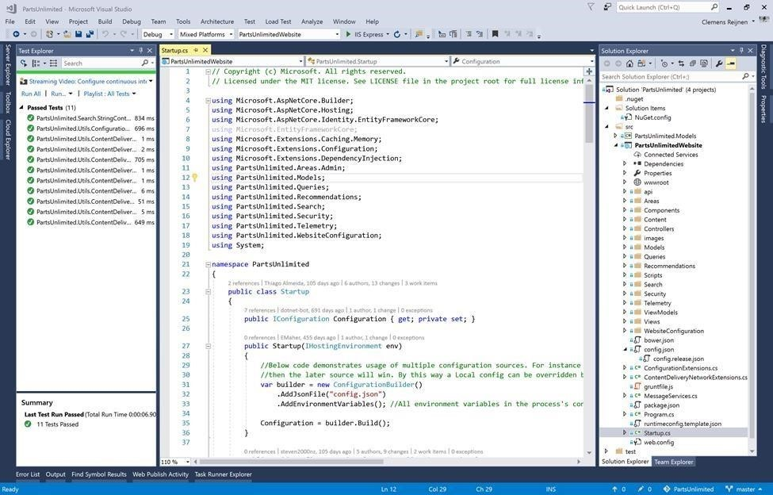
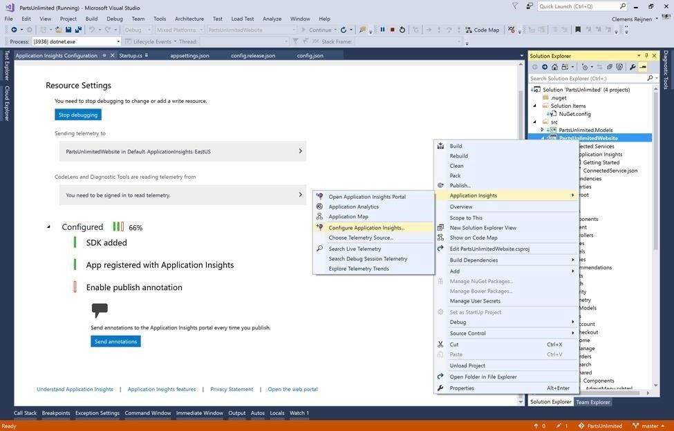
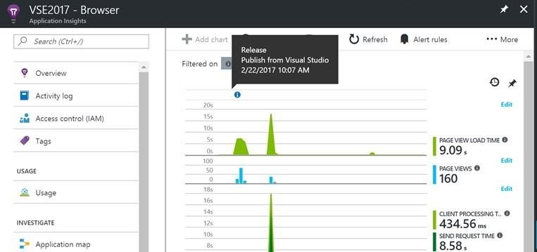

As the business owner of PartsUnlimited, you want to track how the Sales site is used so that you know which part of the site tracks the most users and by whom. When a new feature is added or changed, you want to see the impact of the change with a mark on the telemetry data.  

Implement and configure, as a developer, the usages data of the website. Show the telemetry data in the Azure portal and separate it by release. Make sure the different stages report to different reports.  

<h3>DevOps MPP Course Source </h3>

- This lab is used in course <a href="https://www.edx.org/course/application-monitoring-feedback-loops-microsoft-devops200-7x-0" target="_blank"> Application Monitoring and Feedback Loops</a> - Module 2.

<h3>Prerequisites:</h3>

- Visual Studio
- Complete the earlier lab <a href="https://microsoft.github.io/PartsUnlimited/apm/200.6x-APM-AddAppInsightsTelemetrytoPUwebsite.html" target="_blank"> Add App Insights Telemetry to the PartsUnlimited Website</a> 
- An Azure subscription
- Visual Studio Team Services (VSTS) account and project

<h3>Lab Tasks: </h3>

- Add Usages Telemetry Metering  
- Make Telemetry Metering Stage Specific  
- Set Version Publish Annotations to Telemetry Graphs  

<h3>Estimated Lab Time:</h3>

- approx. 40 minutes  

### Task 1: Open PartsUnlimited with Visual Studio

**NOTE:** If you encounter any difficulties setting up PartsUnlimited with Visual Studio, you can refer back to the detailed lab <a href="https://microsoft.github.io/PartsUnlimited/pandp/200.1x-PandP-PUsetupwithVS2017.html" target="_blank"> PartsUnlimited Setup with Visual Studio </a> for more detailed steps and troubleshooting tips and guidelines.

1.	Open PartsUnlimited within Visual Studio, see the note aboev if you have any difficulties or the earlier lab <a href="https://microsoft.github.io/PartsUnlimited/apm/200.6x-APM-AddAppInsightsTelemetrytoPUwebsite.html" target="_blank"> Add App Insights Telemetry to the PartsUnlimited Website</a> 

2. Restore Packages  

3. Compile the solution and make sure the unit tests execute successfully  
   

    

4. Add or validate the web front-end monitoring for user telemetry by going to the file `_Layout.cshtml` file.

5. Add `@inject Microsoft.ApplicationInsights.AspNetCore.JavaScriptSnippet
JavaScriptSnippet`  

6, Add before the closing head section `@Html.RawJavaScriptSnippet.FullScript)`

### Task 2: Make Telemetry Metering Stage Specific  

1.	Make the instrumentationKey dynamic so it can be set for different stages.  

2. Add an instrumentation key section to config to json and to the config.release.json.  

3. In the `startup.cs`, remove the `.AddJsonFile("appsettings.json")` from  

4. Create telemetry data by running the website and browse the products.  

5. Investigate created front-end request and response data.  

    

### Task 3: Set Version Publish Annotations to Telemetry Graphs  

1.	Add publish annotations Application Insights configuration by stopping debugging.  

2. Then open the Application Insights Resource Settings.  

3. And then configure Publish annotations if not done already.  

4.	Publish the PartsUnlimited website to Azure WebApps and see the publish annotation in the Application Insights graphs.  

5. Right-click on the PartsUnlimited WebApp and select Publish WebApp. (You can follow the steps in the lab <a href="https://microsoft.github.io/PartsUnlimited/pandp/200.1x-PandP-ManualdeploywithVS2017toAzure.html" target="_blank">PartsUnlimited Manual Deployment to Azure App Services with Visual Studio and ARM Templates </a> fir full steps on publishing the PartsUnlimited application to Azure App Services)

    

    

6. Create Azure Resource “PartsUnlimited-RG”.  

7. Publish PartsUnlimited website.  

8. Browse the PartsUnlimited website.  

9. Open the Azure portal Application insight resources see the publish annotation  
    

<h3> Summary</h3>

In this lab you completed the following tasks:
- Add Usages Telemetry Metering  
- Make Telemetry Metering Stage Specific  
- Set Version Publish Annotations to Telemetry Graphs  

