<h1><span style="color: #0000CD;">DevOps200.6x: Application Monitoring and Feedback Loops</span></h1>
============================================================

<h2><span style="color: #0000CD;">Error Reporting and Monitoring with DataDog Lab</span></h2>


A dormant bug may exist in the PartsUnlimited site but it has yet to show itself. We want to give customers the best experience possible in terms of getting issues resolved quickly. To do so, we are going to be setting up logging and custom event monitoring for the PartsUnlimited solution using DataDog. This will assist our engineers by providing rapid feedback around critical releases. Proactive monitoring adds to an all around better user experience and gives our engineering team greater confidence when deploying changes. 

Datadog may be preferable due to a slight difference in it's target user base (admins, operators and the like) as opposed to other APM software. It also has some great infrastructure monitoring executables that are easy to install and provide great coverage around your application stack.

<h3><span style="color: #0000CD;"> Pre-requisites:</span></h3>

- Visual Studio 2017

- An active [DataDog account](https://www.datadoghq.com/datadog-signup/)

- [A DataDog API key](https://app.datadoghq.com/account/settings#api) (after signing up)

<h3><span style="color: #0000CD;"> Lab Tasks:</span></h3>

**Task 1. Create a custom wrapper to log metrics to DataDog** - In this task we will be writing some code to perform our logging calls to DataDog. We will go over the steps required to monitor three different areas of the application - the shopping cart, logins and global exceptions thrown by the application that aren't handled elsewhere.

**Task 2. Deploy the PartsUnlimited Solution to Azure** - In this task we will be going through the steps required to deploy the PartsUnlimited site to Azure.

**Task 3. Trigger some logging to DataDog** - In this task we will be using the deployed PartsUnlimited site to trigger some events that will be logged to DataDog.

**Task 4. Set up a custom event monitor in DataDog** - In this task we will set up a custom monitor to look for particular events logged, then trigger email sendouts to critical or/and on call members of our engineering team.

### Task 1: Create a custom wrapper to log metrics to DataDog
**Step 1.** Clone the repository to a local directory.

Create a parent **Working Directory** on your local file system. For instance, on a Windows OS you can create the following directory:

`C:\Source\Repos`

Open a command line (one that supports Git) and change to the directory you created above.

Clone the repository with the following command. You can paste in the URL if you copied it in Step 1.  In the example below, the clone will be copied into a directory named HOL. Feel free to use whatever directory name you like, or leave it blank to use the default directory name:

	git clone https://github.com/Microsoft/PartsUnlimited.git HOL

After a few seconds of downloading, all of the code should now be on your local machine.

Move into the directory that was just created.  In a Windows OS (and assuming you used HOL as the directory name), you can use this command:

	cd HOL

**Step 2.** Create a new setting for our datadog [API key](https://app.datadoghq.com/account/settings#api) and base URL. This is located inside the website project -> `./HOL/src/PartsUnlimitedWebsite/config.json`

This will sit under the "Keys" section.
```json
    "Keys" {
        ...
        "DataDog":{
            "ApiKey": "XXXXXXXXXXXXXXXX",
            "BaseUrl": "http://app.datadoghq.com/api/v1/"
        }
    }
```

**Step 3.** Create the configuration settings initializer. These can sit anywhere under the PartsUnlimitedWebsite project.
```csharp
    public interface IDataDogSettings
    {
        string ApiKey { get; set; }
        string BaseUrl { get; set; }
    }

    public class ConfigurationDataDogSettings : IDataDogSettings
    {
        public ConfigurationDataDogSettings(IConfiguration config)
        {
            ApiKey = config[nameof(ApiKey)];
            BaseUrl = config[nameof(BaseUrl)];
        }

        public string ApiKey { get; set; }
        public string BaseUrl { get; set; }
    }
```

**Step 4.** Now we need to set up our dependency injection correctly. Navigate to the Startup class. This will tell our configuration where to look in order to load the DataDog specfic settings (Under Keys -> DataDog)
```csharp
    public void ConfigureServices(IServiceCollection services)
    {
        ...

        services.AddScoped<IDataDogSettings>(p => new ConfigurationDataDogSettings(Configuration.GetSection(ConfigurationPath.Combine("Keys", "DataDog"))));

        ...
    }
```

**Step 5.** Now we want to create the contract we're using to communicate with DataDog. This can be found in the DataDog API -> http://docs.datadoghq.com/api/?lang=console#events. Create a new class called DataDogEventRequest.cs under the `Telemetry` folder -> `./HOL/src/PartsUnlimitedWebsite/Telemetry/`

```csharp
    public class DataDogEventRequest
    {
        public string Title { get; set; }
        public string Text { get; set; }
        public string Priority { get; set; }
        public List<string> Tags { get; set; }
        public string Alert_Type { get; set; }
    }
```
**Step 6.** Create another class called DataDogEventLogger.cs
```csharp
    public interface IEventLogger
    {
        void Trace(string message);
        void TrackException(Exception exception);
    }

    public class DataDogEventLogger : IEventLogger
    {
        private readonly IDataDogSettings _config;

        public DataDogEventLogger(IDataDogSettings config)
        {
            if (config == null)
                throw new ArgumentNullException(nameof(config));
            _config = config;
        }

        public async void Trace(string message)
        {
            DataDogEventRequest request = new DataDogEventRequest
            {
                Title = message,
                Priority = "normal",
                Text = message,
                Alert_Type = "info",
                Tags = new List<string> { "trace"}
            };
            ;
            await Request(request, "events");
        }

        public async void TrackException(Exception exception)
        {
            DataDogEventRequest request = new DataDogEventRequest
            {
                Title = exception.Message,
                Priority = "high",
                Text = exception.StackTrace,
                Alert_Type = "error",
                Tags = new List<string> { "exception" }
            };
            await Request(request, "events");
        }

        private async Task<HttpResponseMessage> Request<T>(T payload, string target)
        {
            using (var client = new HttpClient())
            {
                client.BaseAddress = new Uri(_config.BaseUrl);
                client.DefaultRequestHeaders.Accept.Clear();
                client.DefaultRequestHeaders.Accept.Add(new MediaTypeWithQualityHeaderValue("application/json"));

                string requestTarget = target + $"?api_key={_config.ApiKey}";
                HttpContent content = new StringContent(await Task.Run(() => JsonConvert.SerializeObject(payload)));
               
                return await client.PostAsync(requestTarget, content);

            }
        }
    }
```
Let's provide a bit more context for each of these methods.

We have a private method in this class which will be wrapping up our REST requests to datadog (**D**ont **R**epeat **Y**ourself!). This creates a new client with all the required attributes to communicate with the datadog API (API keys and the base URL).

We have the following:

- The base address "https://app.datadoghq.com/api/v1/"

- The JSON accept header of "application/json"

- The API key attachment

We also have the Trace and TrackException methods which, under the hood, are very similar. The only real difference being the information logged to DataDog.

**Step 7.** Now, in order to catch exceptions make by our application we are going to want some sort of global exception catcher. Let's create a global exception **filter** for our application to ensure all unhandled exceptions are logged to DataDog.

```csharp
    public class CustomExceptionFilterAttribute : ExceptionFilterAttribute
    {
        private readonly IEventLogger _eventLogger;

        public CustomExceptionFilterAttribute(
            IEventLogger eventLogger)
        {
            if (eventLogger == null)
                throw new ArgumentNullException(nameof(eventLogger));
            _eventLogger = eventLogger;
        }

        public override void OnException(ExceptionContext context)
        {
            _eventLogger.TrackException(context.Exception);
        }
    }
```
**Step 8.** To ensure this custom exception filter is applied across our application we can add it to the default set of MVC filters. Navigate back to the Startup.cs class. Note we also want to bind our event logger just in case we want this to be used somewhere else in the application.

```csharp
        public void ConfigureServices(IServiceCollection services)
        {
            ...
            // get our datadog settings from the config file
            IDataDogSettings configurationDataDogSettings =
                new ConfigurationDataDogSettings(
                    Configuration.GetSection(ConfigurationPath.Combine("Keys", "DataDog")));

            services.AddScoped(p => configurationDataDogSettings);
            services.AddScoped<IEventLogger, DataDogEventLogger>();
            
            // add our custom exception handler to the application filter set
            services.AddMvc(
                opts =>
                {
                    opts.Filters.Add(new CustomExceptionFilterAttribute(new DataDogEventLogger(configurationDataDogSettings)));
                });

            ...
        }
```

**Step 9.** Now, let's add some tracing in our Controllers. Firstly, let's add some tracing around when people add items to their cart. Navigate to ShoppingCartController.cs

```csharp
    public class ShoppingCartController : Controller
    {
        ...
        private readonly IEventLogger _eventLogger;

        public ShoppingCartController(
            ...
            , IEventLogger eventLogger)
        {
            ...
            _eventLogger = eventLogger;
        }

        public async Task<IActionResult> AddToCart(int id)
        {
            // Retrieve the product from the database
            var addedProduct = _db.Products
                .Single(product => product.ProductId == id);

            _eventLogger.Trace($"Cart/Server/Add/{addedProduct.Title}");

            ...
        }
    }
```

Now we want to trace when an order has been completed. Navigate to CheckoutController.cs

```csharp
    public class CheckoutController : Controller
    {
        ...
        private readonly IEventLogger _eventLogger;

        public CheckoutController(
            ...
            , IEventLogger eventLogger)
        {
            ...
            _eventLogger = eventLogger;
        }

        public IActionResult Complete(int id)
        {
            ...

            if (order != null)
            {
                _eventLogger.Trace($"Checkout/Server/Complete/OrderId/{id}/Total/{order.Total}");
                ...
            }
            ...
        }
    }
```

Let's also trace when a category is browsed to - this could provide valuable data for the marketing team by showing them popular categories and not so popular categories. Navigate to StoreController.cs


```csharp
    public class StoreController : Controller
    {
        ...
        private readonly IEventLogger _eventLogger;

        public StoreController(
            ...
            , IEventLogger eventLogger)
        {
            ...
            _eventLogger = eventLogger;
        }

        public IActionResult Browse(int categoryId)
        {
            ...
            var categoryModel = _db.Categories.Single(g => g.CategoryId == categoryId);
            _eventLogger.Trace($"Store/Server/Browse/{categoryModel.Name}");
            ...
        }

```

We also want to see what people are searching for, this could potentially assist our UX team to ensure the customer can get to what they want faster and more intuitively. Navigate to SearchController.cs

```csharp
    public class SearchController : Controller
    {
        ...
        private readonly IEventLogger _eventLogger;

        public SearchController(
            ...
            , IEventLogger eventLogger)
        {
            ...
            _eventLogger = eventLogger;
        }

        public async Task<IActionResult> Index(string q)
        {
            if (string.IsNullOrWhiteSpace(q))
            {
                return View(null);
            }
            _eventLogger.Trace($"Search/Server/Index/Query/{q}");
            ...
        }

```

For our user management, we want to check failures on the change password action. Navigate to ManageController.cs


```csharp
    public class ManageController : Controller
    {
        private readonly IEventLogger _eventLogger;

        public ManageController(UserManager<ApplicationUser> userManager, SignInManager<ApplicationUser> signInManager, IEventLogger eventLogger)
        {
            ...
            _eventLogger = eventLogger;
        }

        ...

        [HttpPost]
        [ValidateAntiForgeryToken]
        public async Task<IActionResult> ChangePassword(ChangePasswordViewModel model)
        {
            ...
            var user = await GetCurrentUserAsync();
            if (user != null)
            {
                ...
                if (result.Succeeded)
                {
                    ...
                }
                _eventLogger.Trace($"Manage/Server/ChangePassword/Failure/{user.Name}");
                ...
            }
            ...
        }

    }
```

Lets also log when a user has a failed login attempt. Navigate to the AccountController. Just underneath ModelState.AddModelError we want to trace the error and log it to DataDog.

```csharp
    public class AccountController : Controller
    {
        private readonly IEventLogger _eventLogger;

        public AccountController(UserManager<ApplicationUser> userManager, SignInManager<ApplicationUser> signInManager, IEventLogger eventLogger)
        {
            ...
            _eventLogger = eventLogger;
        }

        ...

        // POST: /Account/Login
        [HttpPost]
        [AllowAnonymous]
        [ValidateAntiForgeryToken]
        public async Task<IActionResult> Login(LoginViewModel model, string returnUrl = null)
        {
            ...

            ModelState.AddModelError("", "Invalid login attempt.");
            _eventLogger.Trace($"Account/Server/Login/Failure/{model.Email}");
            return View(model);
        }

    }
```

### Task 2: Deploy the PartsUnlimited Solution to Azure

Lets get our modified app in to Azure! From the solution view, right click on the PartsUnlimitedWebsite project and then select 'Publish...'


Now we want to create a publish profile to a Microsoft Azure App Service.

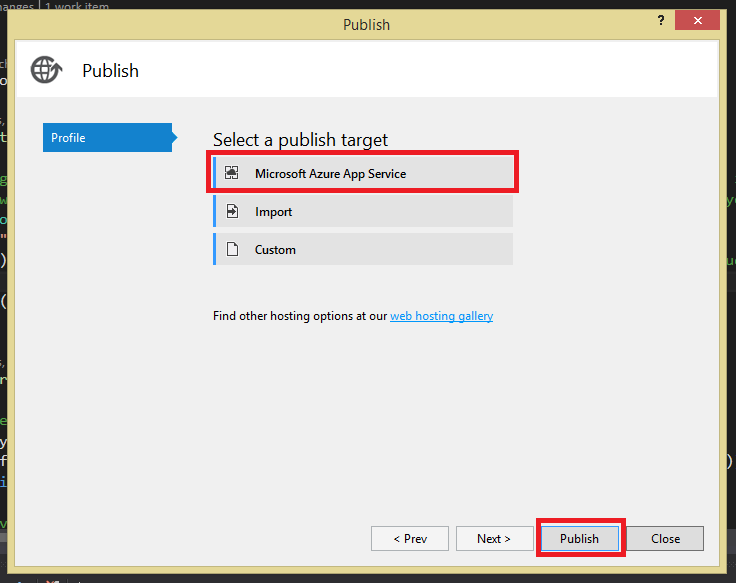

If you have an app service created in Azure, you can select it from here. Otherwise you can select 'New...' to create one.

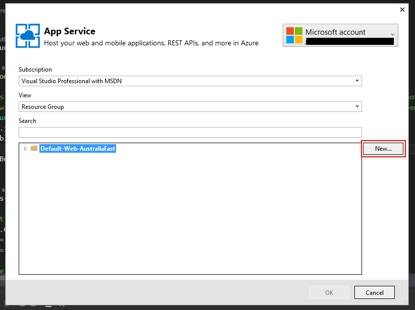

Create a unique web app name and assign it to a familar resource group. Note: Keep similar items in the same resource group. As your Azure subscription grows this will assist greatly for knowing which things are related.

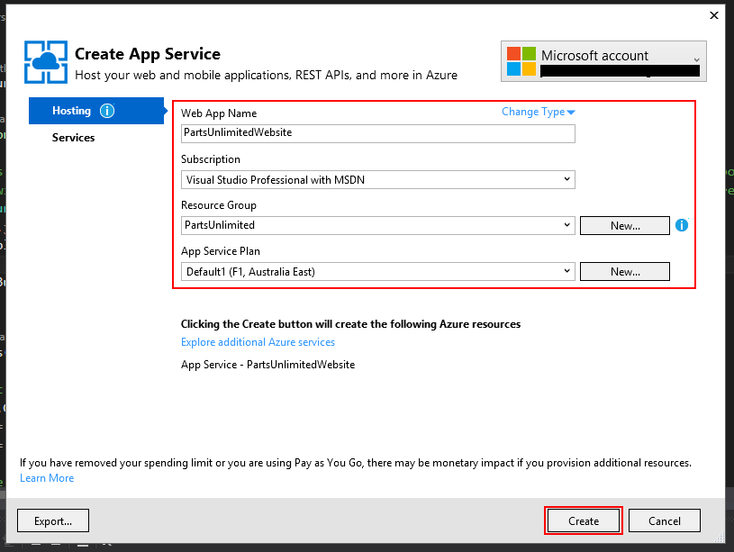

Now you should see the deployment step allocating your app.


The following form should be filled out. Take note of the server you are deploying to so you can navigate to it in later steps. Select 'Publish' if everything looks good!

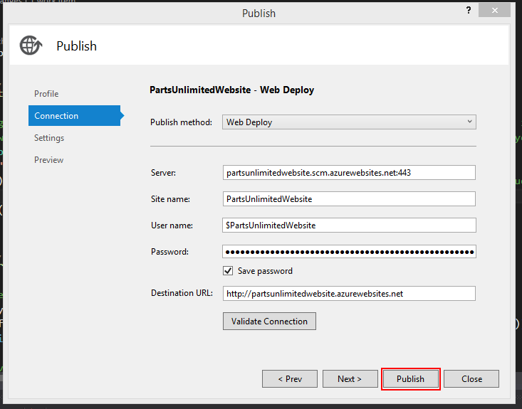

NOTE: if you are **not using Visual Studio** you can set this up using the [Azure CLI](https://azure.microsoft.com/en-us/downloads/#cmd-line-tools)

For example, if you have [nodejs](https://nodejs.org) installed on a linux machine we can install the Azure CLI via NPM. 

```
    npm install -g azure-cli
```

Or you may need to use **sudo** to successfully run the npm command.

```
    sudo npm install -g azure-cli
```

Now run the following commands to create an App Service resource in Azure.

```
    azure config mode arm
    azure login
```

This will prompt you to to login and provide command line access to your Azure subscription.

```
    azure group create -n "ExampleResourceGroup" -l "westus"

    azure appserviceplan create --name partsunlimitedserviceplan --location "westus" --resource-group ExampleResourceGroup --sku P1

    azure webapp create --name partsunlimitedsite --location "westus" --resource-group ExampleResourceGroup --plan partsunlimitedserviceplan
```

Now you will need to navigate to the [azure portal](https://portal.azure.com) and turn on local git deployments.

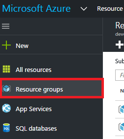

Look for the **ExampleResourceGroup** we created earlier, then find the **partsunlimitedsite** web app we created. We then want to alter the **deployment options**. Select **Local Git Repository**, create a deployment user then select **OK**.

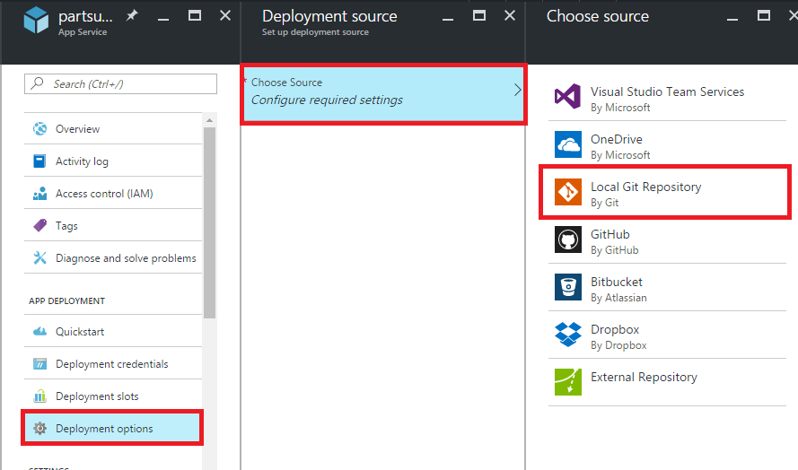

Now navigate to the overview page of the web app and note down the git clone url.

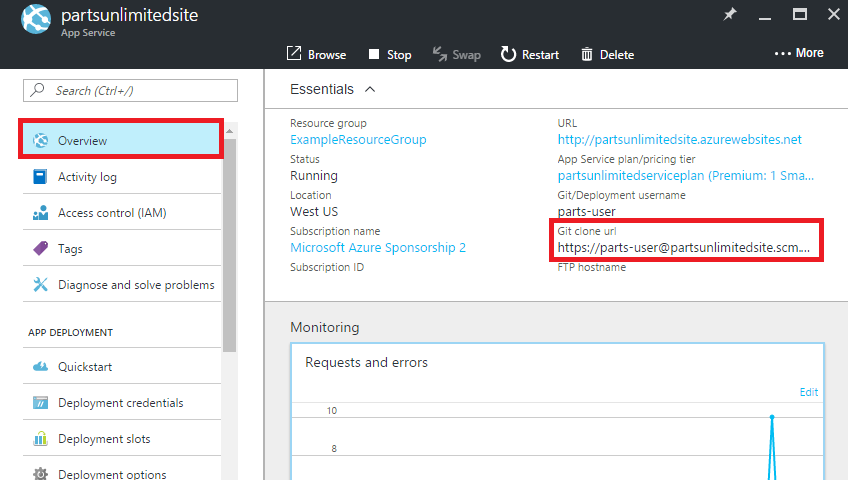

Now we want to create the git remote to deploy to (use the clone url we got from the azure portal)

```
    git remote add azure https://theuseryoujustcreate@yoursitenamehere.scm.azurewebsites.net:443/yoursitenamehere.git
```

Now we need to add a deployment script to ensure our application unpacks correctly on the app service. From the root folder of this HOL document locate the **.deployment** and **deploy.cmd** script `.\HOL\docs\HOL-Error_Reporting_and_Monitoring_with_DataDog\` -> move these to the root folder of the application `./HOL`

Now we're ready to deploy. Type the following commands to add the deployment files to source. This may take some time to complete.

```
    git add -A
    git commit -m "Adding deployment scripts"
    git push azure master
```

### Task 2: Trigger some logging to DataDog

**Step 1.** Navigate to the deployed website.

**Step 2.** Now, lets trigger some actions. 

- Navigate to the login page and try any username with any password a few times.
- Try and add an item to your cart.
- Try using the search bar located at the top of the site.
- Try completing an order.
- Login with the following credentials -> user: `Administrator@test.com` password: `YouShouldChangeThisPassword1!`. Then try to **unsuccessfully** change your password under the 'Profile -> Manage Account' section.

**Step 4.** Navigate to the DataDog portal to check and see if everything was logged correctly -> https://app.datadoghq.com/event/stream

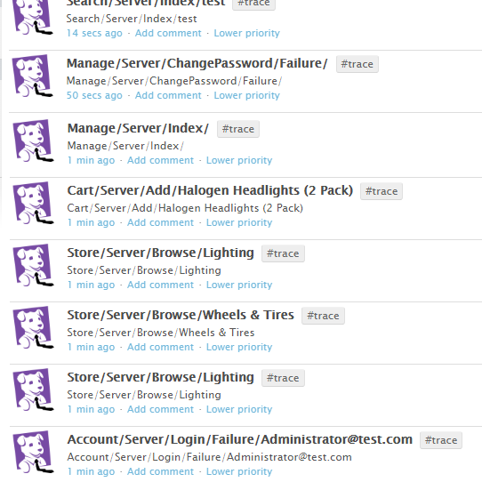

### Task 3: Set up a custom event monitor in DataDog

Lets say, for example, we want to add a monitor for when failed login attempts occur within a certain time peroid. Log in to the DataDog portal and create a new monitor (Monitors -> New Monitor)

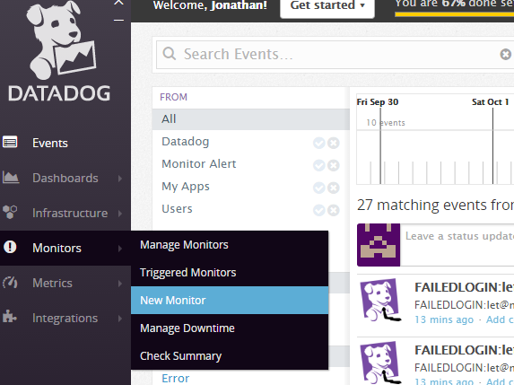

Select the 'Event' monitor

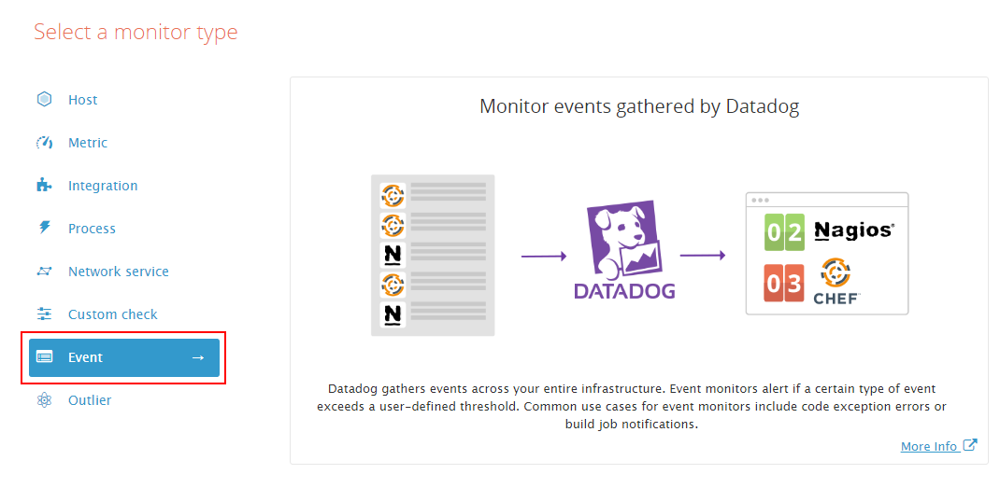

Here we want to track items with the #trace tag as that's what we use for failed login attempts. Note: you can make these more specific if you wish!

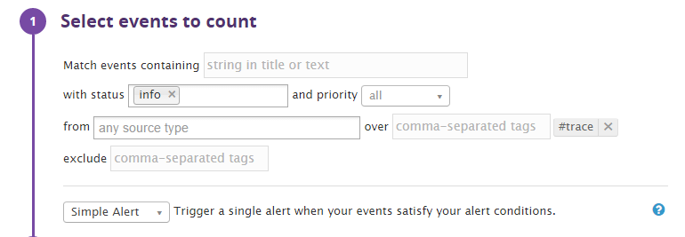

Here we will set the criteria for the monitor to notify. Here we have set it to above or equal to 3. You will probably want to set this higher for production.


Here we can specify what we want to send once the monitor has been triggered. We can provide context to ensure the person or people notified have the best information available to fix the issue at hand.

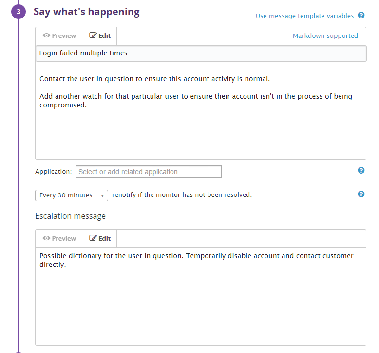

Here you can set which team members you'd like notified if this monitor is triggered.

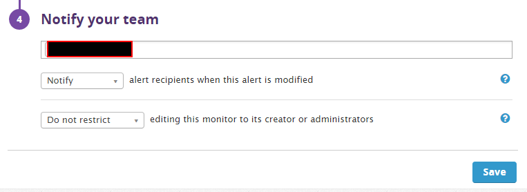

Now lets test it out! Go back to the application and trigger some failed login attempts.

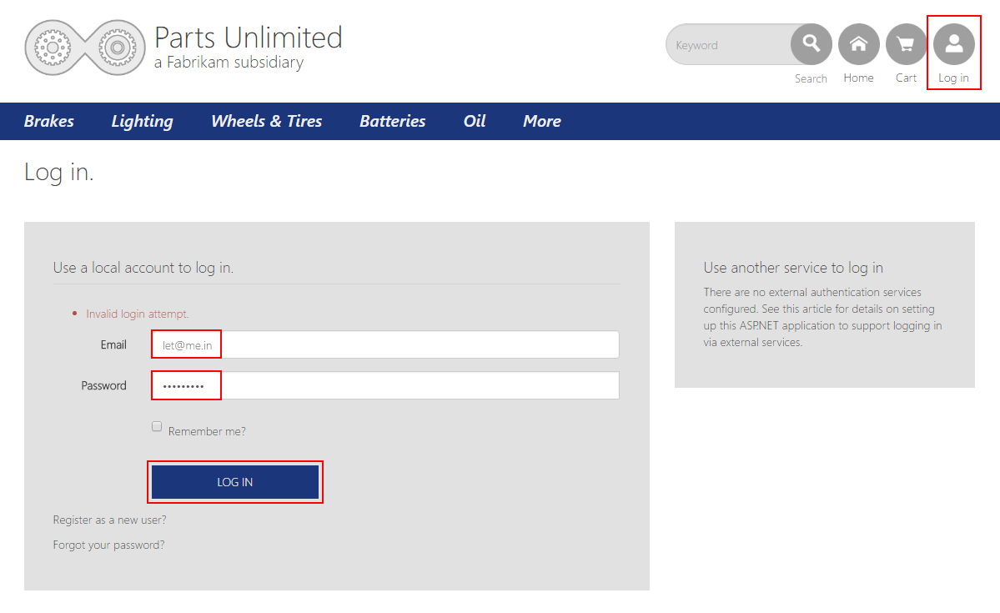

Give it some time then check your emails. You should have an alert sitting in your inbox.

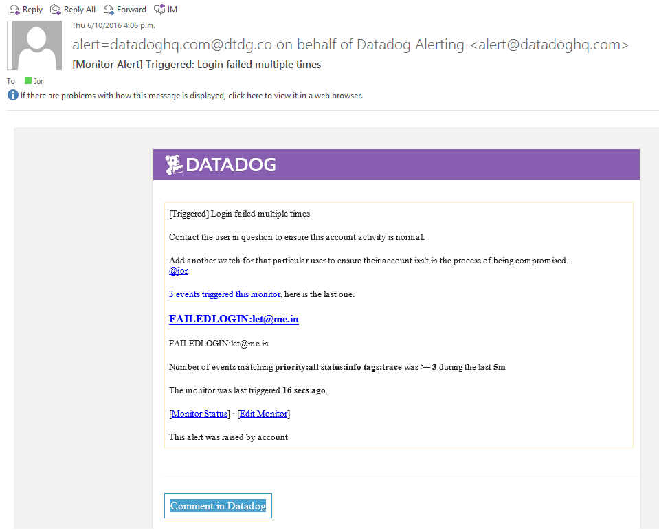

You will also get a follow up email if the event stops triggering after a set time period. You can leverage this to ensure you don't have any false positives.

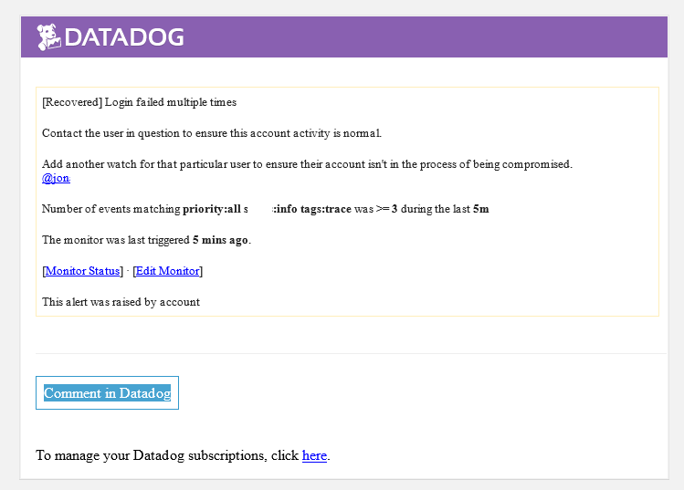
