The sales of PartsUnlimited is expanded globally to multiple regions. These regions are Asia, West Europe, and North Europe. From Asia, a lot of traffic is expected on the search part of the website, due to interest in Jumper Leads from that area. The product owners from PartsUnlimited want to monitor the availability of the website from all regions. Next to availability monitoring, they also want to be sure the website stays responsive when an enormous load is taken from Asia on the search part of the site.  

Validate Europe is still available when the Asia load is generated

<h3>DevOps MPP Course Source </h3>

- This lab is used in course <a href="https://www.edx.org/course/application-monitoring-feedback-loops-microsoft-devops200-7x-0" target="_blank"> Application Monitoring and Feedback Loops</a> - Module 2.

<h3>Prerequisites:</h3>

- Visual Studio
- An Azure subscription
- Complete the earlier lab <a href="https://microsoft.github.io/PartsUnlimited/apm/200.6x-APM-AddAppInsightsTelemetrytoPUwebsite.html" target="_blank"> Add App Insights Telemetry to the PartsUnlimited Website</a> 
- Complete the earlier lab <a href="https://microsoft.github.io/PartsUnlimited/apm/200.6x-APM-ConfigTelemetryData.html" target="_blank"> Configure Telemetry Data </a> 

<h3>Lab Tasks: </h3>

- Set Availability Ping Tests for PartsUnlimited Website  
- Create Multi-Step Web Test  
- Create Cloud Load Test  

<h3>Estimated Lab Time:</h3>

- approx. 40 minutes  

### Task 1: Set Availability Ping Tests for PartsUnlimited Website  

1.	Continue from creation of Application Insights resources and Azure App Services resource in previous labs.   

    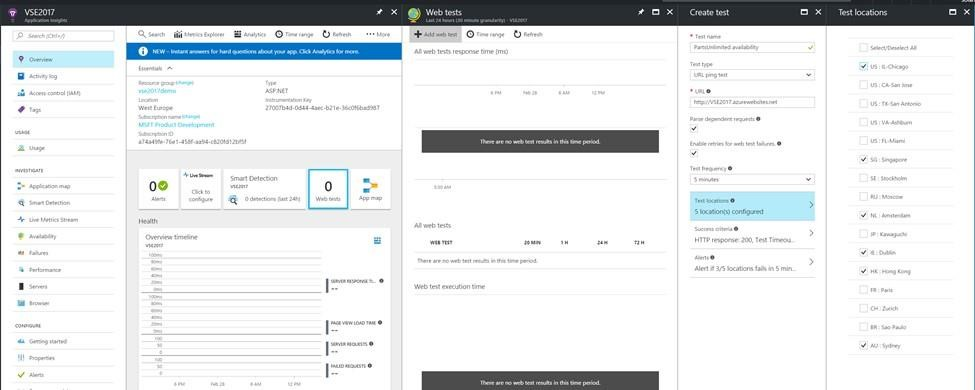

2. Open the Azure Portal and go to the Application Insights resource.  

3. Select Web Tests in the overview pane.  

4. Add WebTest, “PartsUnlimited availability”.  

5. Select locations in Asia and Europe.  

6. Investigate the graph.  	

    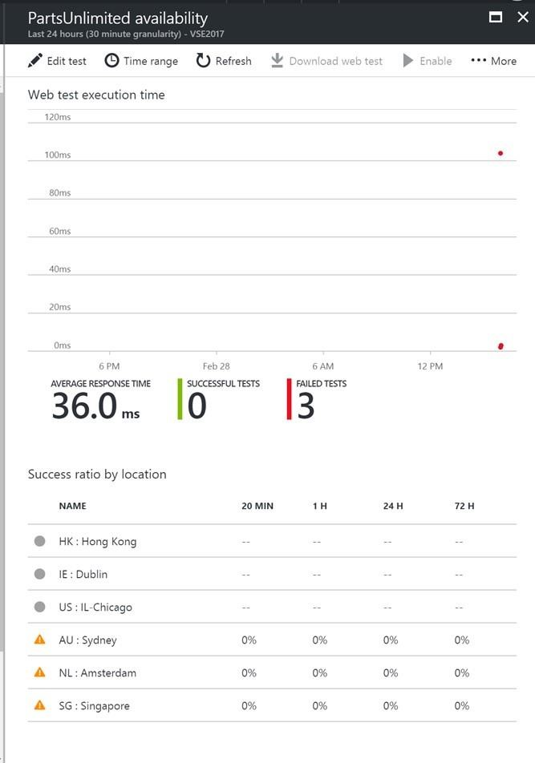

### Task 2: Create Multi-Step Web Test  

Create add to basket multi step test, with response time requirement in Visual Studio.   

1.	Open Visual Studio with the PartsUnlimited solution.    

    Note: If the load and performance project isn’t available, install it via the Visual Studio Installer.)  

    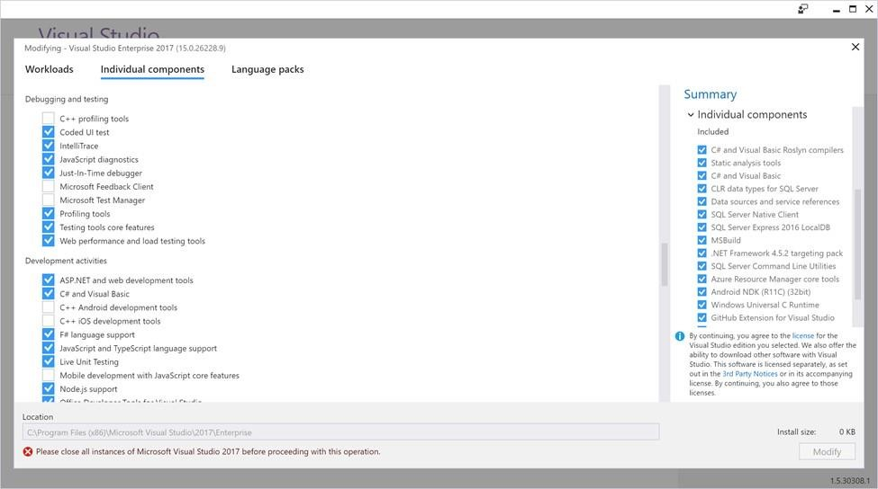

2. Select the solution folder Tests and add a WebAndLoadTests project. Name it: PartsUnlimited.WebAndLoadTests.  

    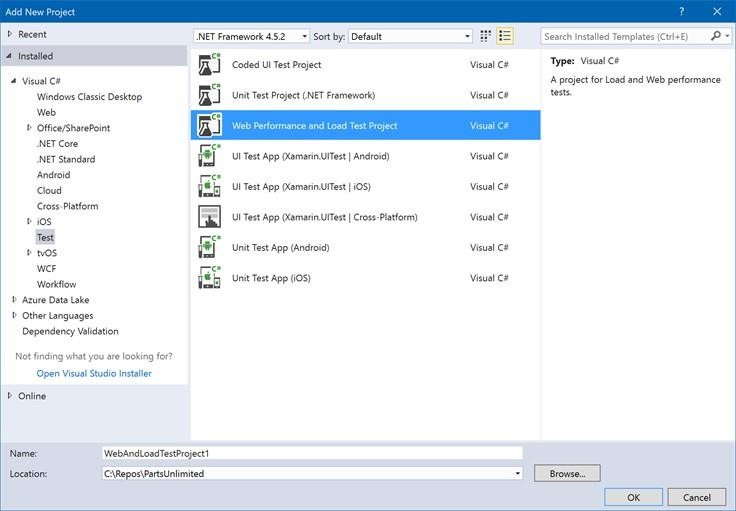

3. Right-click on the WebAndLoadTest project and add a Web Performance Test.  
    
    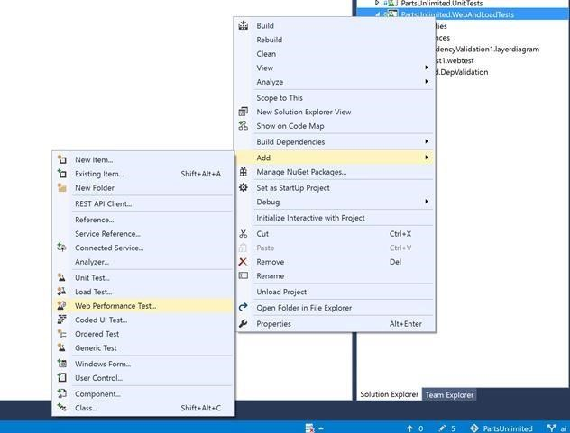

4. Record the checkout scenario with the web test recorder by opening the PartsUnlimited website.  

5. Select ‘jumper lead’ product.  

6. Select the product and check out

7. Stop the recording.  

8. Delete any requests made to any host different than *.azurewebsites.net (e.g., calls to app Insights, like dc.services.visualstudio.com) to make sure the test isn’t testing any external service like Application Insights.  

    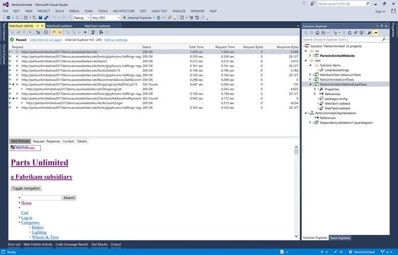

9. Rename the WebTest to ‘CheckoutProductScenario.webtest’.  

10. Add a Maximum Request Time Validation to validate requests are processed within 1 second.  

    
    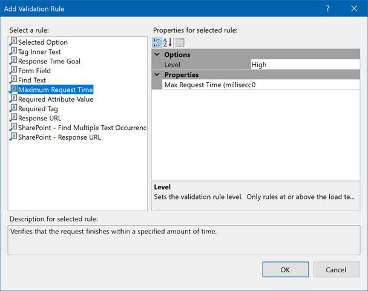

11. Run the web test scenario and validate all requests are responding within 1 second. 

    Note: when a test step returns a 404 on a jquery request, set the property ‘parse dependent requests’ to false.  

12. Set the multi-step test as an availability test for Europe regions by opening the Azure portal and go to the Application Insights resource.  
13. Select availability tests.  

14. Add the CheckoutProductScenario.webtest multi-step tests.  

    
    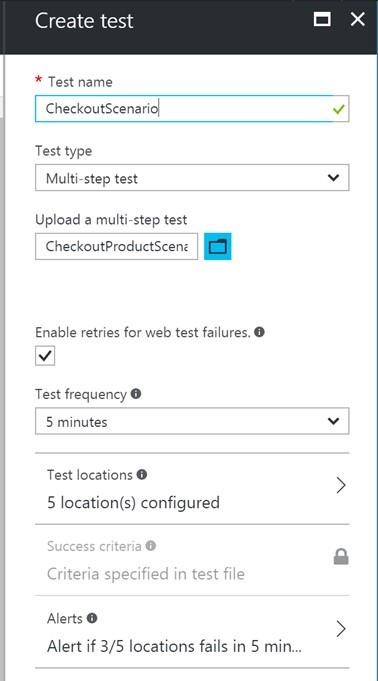 

15. Set the locations to run the test from to Europe and US locations.  

16. Configure the WebTest to send alerts to your email address.  

17. Set the locations to run the test from to Europe and US locations.  

18. Configure the WebTest to send alerts to your email address.  

    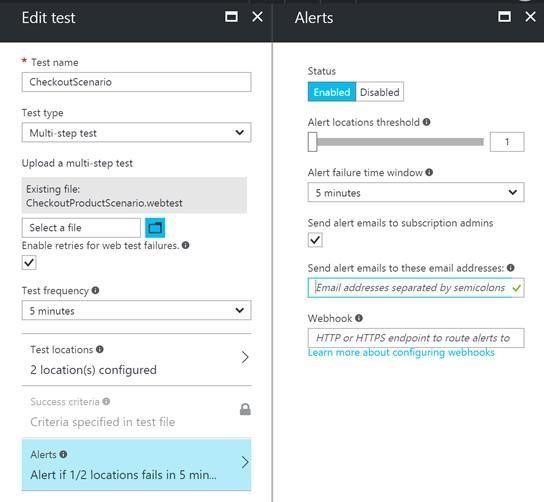 

19. Wait 10 minutes and investigate the results in the Azure portal.

     

20. Select the Checkout web test and investigate the results.   

### Task 3: Create Cloud Load Test 

1. Create Cloud Load test for Asia search load by adding performance test to the Visual Studio project.  

2. Record the scenario for searching for jumper leads and batteries by opening website PartsUnlimited.  

4. Search for Batteries.  

5. Select Battery product. 

6. Search for Jumper Lead.  

7. Select Jumper Lead product.  

    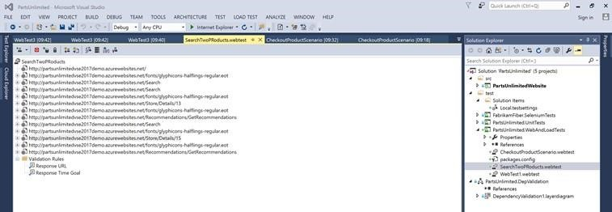 

8. Delete any requests made to any host different than *.azurewebsites.net (e.g., calls to App Insights like dc.services.visualstudio.com) to make sure the test isn’t testing any external service like Application Insights.  

9. Run the performance test to validate the run successes.   

    Note: when a test step returns a 404 on a jquery request, set the property `parse dependent requests` to *false*.  

10. Save the WebPerformance test as SearchProducts.webtest.  

11. Add a Load Test to the WebAndLoadTests project.  

    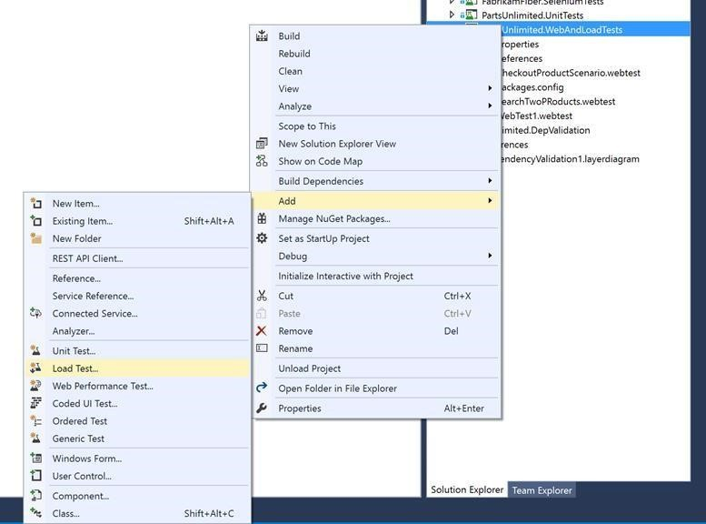 

12. Select Cloud Load Test.  

    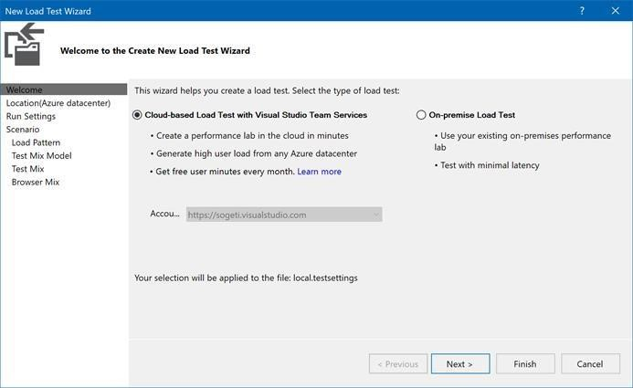 

13. Create load test for **10.000 users** for **10 minutes**. Keep all settings in the New Load Test Wizard to default except:  
    - Set load test run settings to 10 minutes.  

    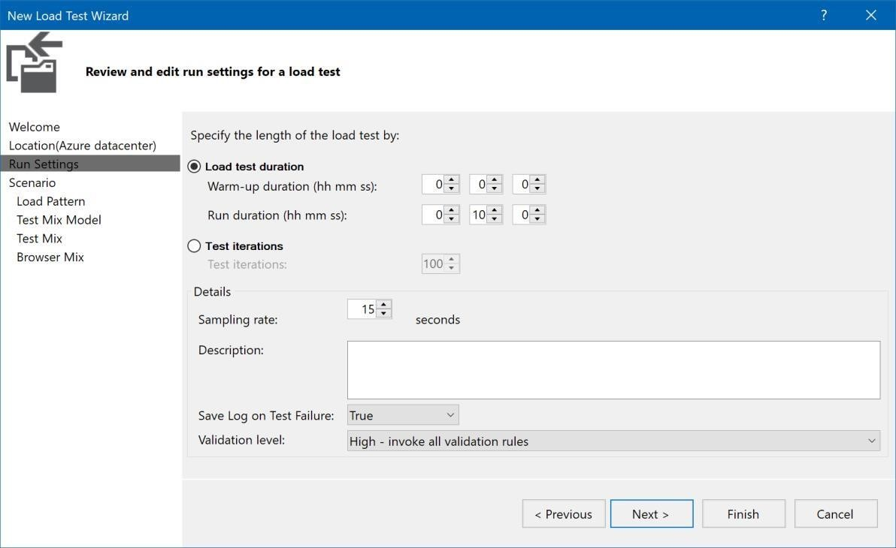 

    - Set Load Pattern to ‘Step Load’ maximum user count 10.000  

    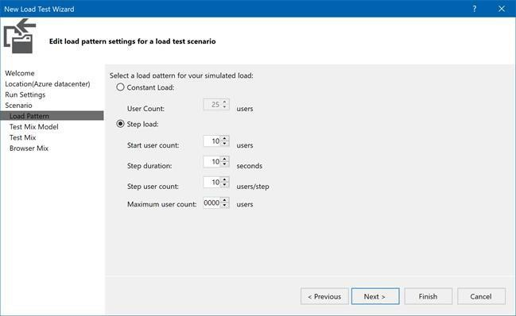 

    - Select the SearchProducts.webtest as the only test to execute.  

    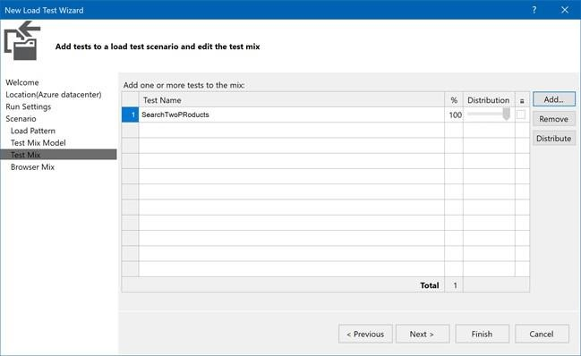 

14. Run the load test.  

15. Investigate the result. Look at the graphs focus on the failing request and user load

     

16. Investigate the Availability tests. Focus on the failing test during the load test. This indicates the checkout process in the US and EU are influenced by the search activity load.  

    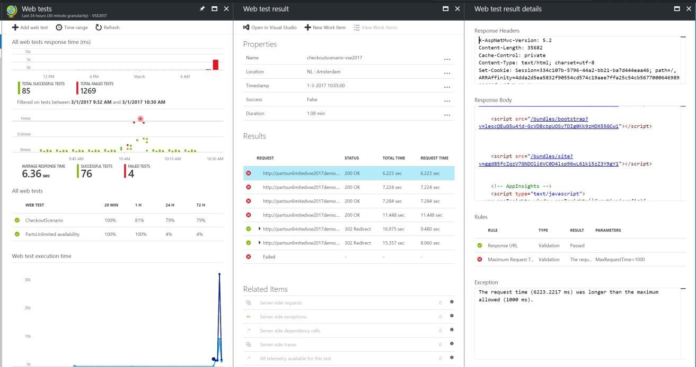 

17. Investigate mailbox on send alerts from the WebTest.  

    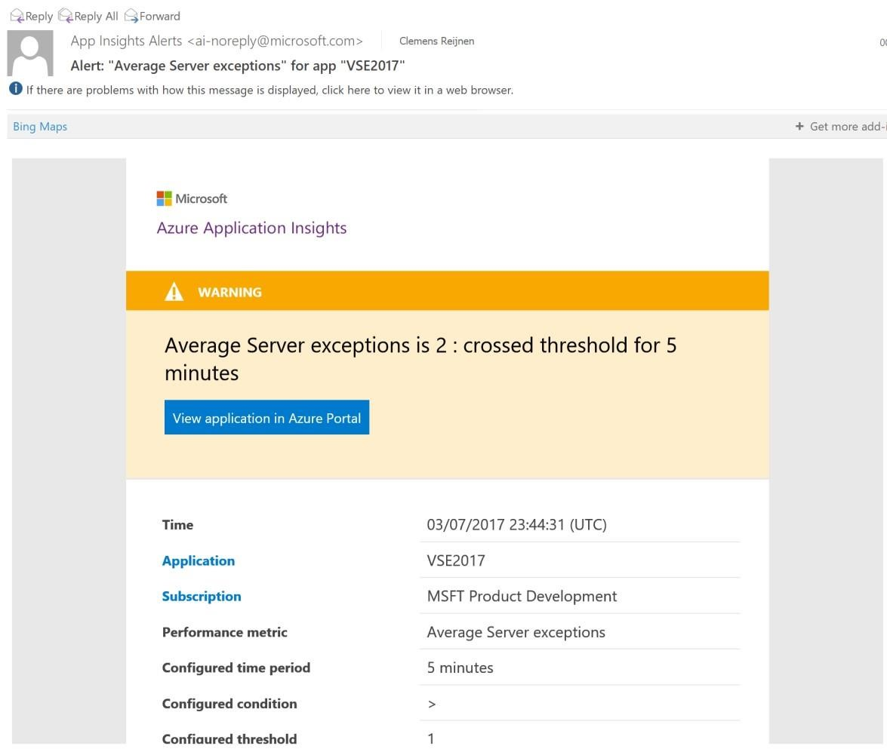

<h3> Summary</h3>

In this lab you completed the following tasks:
- Set Availability Ping Tests for PartsUnlimited Website  
- Create Multi-Step Web Test  
- Create Cloud Load Test  

