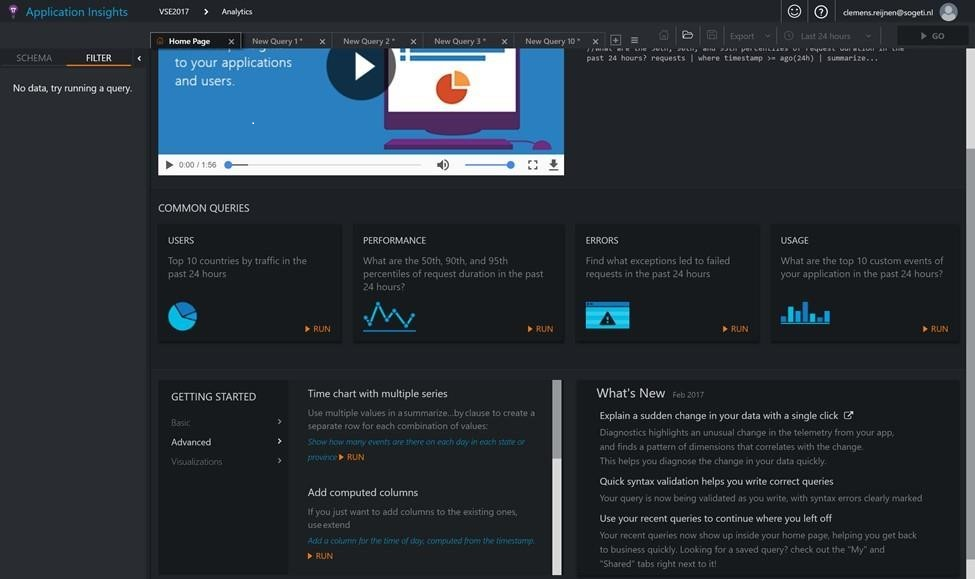

In this lab we will configure queries on health monitoring data with Log Analytics and Aplication Maps


<h3><span style="color: #0000CD;">DevOps MPP Course Source </span></h3>

- This lab is used in course <a href="https://www.edx.org/course/application-monitoring-feedback-loops-microsoft-devops200-7x-0" target="_blank"><span style="color: #0066cc;" color="#0066cc"> Application Monitoring and Feedback Loops</span></a> - Module 3.


<h3><span style="color: #0000CD;">Prerequisites:</span></h3>

- Visual Studio
- An Azure subscription
- Complete the earlier lab <a href="https://microsoft.github.io/PartsUnlimited/apm/200.6x-APM-HealthandPerfMonitoring.html" target="_blank"><span style="color: #0066cc;" color="#0066cc"> Health and Perf Mon with Ping, Web and Load Tests in Visual Studio  </span></a> 


<h3><span style="color: #0000CD;">Lab Tasks: </span></h3>

- Add Log Analytics Query 
- View Application Map


<h3><span style="color: #0000CD;">Estimated Lab Time:</span></h3>

- approx. 40 minutes  


### Task 1: Add Log Analytics Query   


1. Open Azure portal.  

2. Go to the created Application Insights resource available from the lab <a href="https://microsoft.github.io/PartsUnlimited/apm/200.6x-APM-HealthandPerfMonitoring.html" target="_blank"><span style="color: #0066cc;" color="#0066cc"> Health and Perf Mon with Ping, Web and Load Tests in Visual Studio  </span></a>   

3. Select **Analytics** in the overview top-menu bar.  

4. Investigate the query language capabilities.  

5. Select **Getting Started* > **Advanced** > **Time chart with multiple series**.

    

6. Open a new query screen.  

7.	Add the following query to get the top 10 common page flows for my users:  

    ```
    pageViews
    | WHERE TIMESTAMP >= AGO(1D)  
    | ORDER BY TIMESTAMP DESC  
    | SUMMARIZE PAGESVISITED=MAKELIST(NAME) BY SESSION_ID  
    | SUMMARIZE COUNT() BY TOSTRING(PAGESVISITED)  
    | TOP 20 BY COUNT_ DESC  
    ```

 
    


### Task 2: View Application Map

1.	Go to the Azure Application Insights Overview Blade, 

2. click on the **Application Map** button to open the Application Map. Investigate the application Map. 

    Dependencies are automatic capture, client/server side components, and SQL server components, along with status and basic performance metrics of each component.  

2.	Click on any red/orange warning symbols to open actual failure details to can click through and investigate.  


<h3><span style="color: #0000CD;"> Summary</span></h3>

In this lab you completed the following tasks:
- Add Log Analytics Query 
- View Application Map
